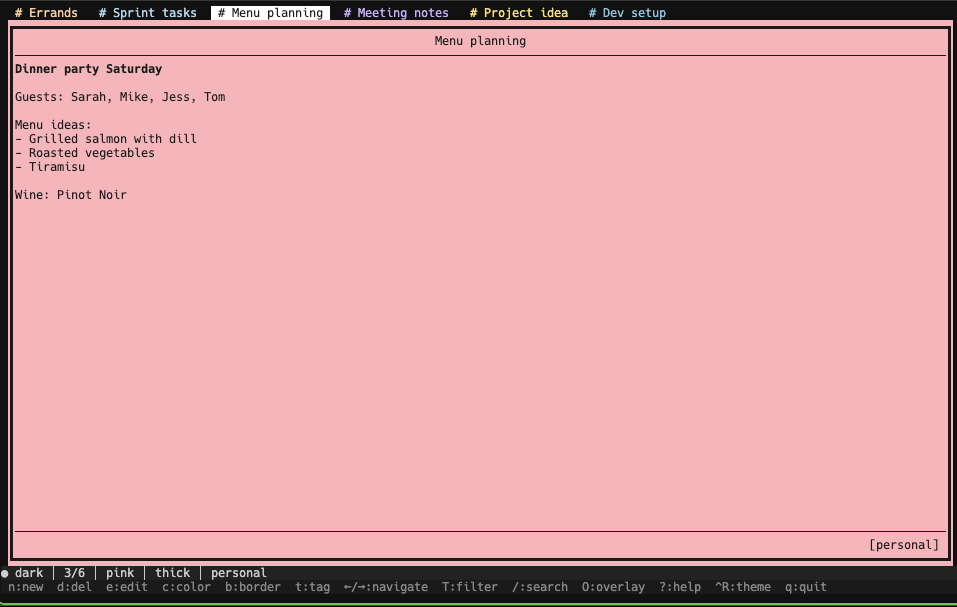
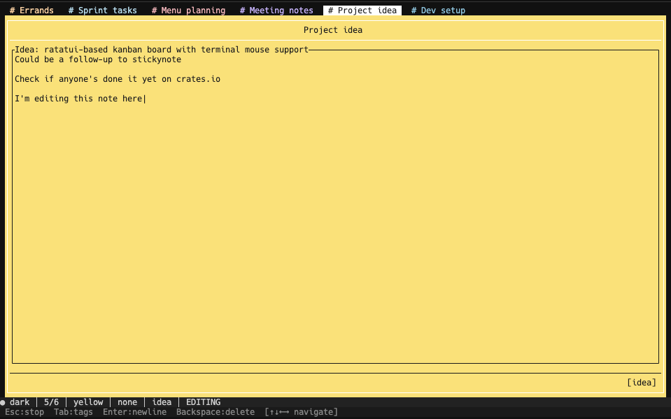
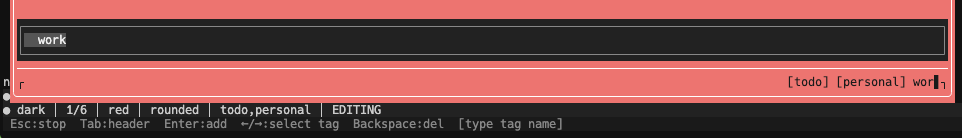
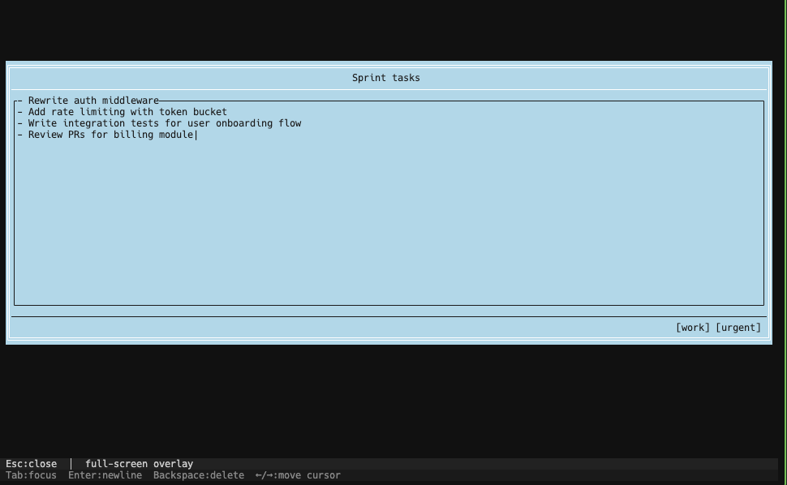
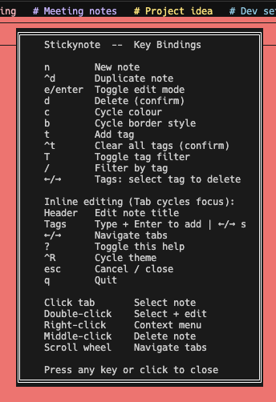
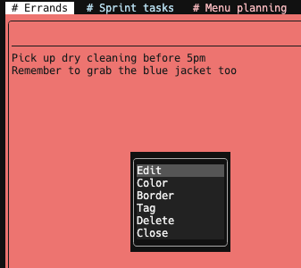

# stickynote

A sticky notes board for your terminal. Built with [Ratatui](https://ratatui.rs) and Crossterm.

I wanted a place to dump thoughts without leaving the terminal — no browser tab, no Electron app, no sync service. Just a JSON file on disk and a TUI that gets out of the way.

## What it looks like



A board with a handful of notes — the tab bar at the top, a full note card in the middle, status and hint bars at the bottom.



Edit mode gives each section its own focus and cursor. Tab cycles between Header → Content → Tags. The focused section gets a thick black border; single-line sections expand to fit top/bottom borders.



Tags autocomplete as you type, pulling from every tag already on the board. Tab fills the highlighted suggestion, Enter commits it.



Overlay mode (`O`) drops the selected note full-screen when you need focus.



Help (`?`) keeps a keyboard reference handy, themed to match whatever colour scheme is active.



Right-click a tab for quick actions: edit, change colour or border, add a tag, duplicate, or delete.

## Install

You need Rust 1.85+ (the crate uses edition 2024).

### From crates.io

```bash
cargo install stickynote
```

### From source

```bash
git clone https://github.com/narqulie/stickynote.git
cd stickynote
cargo build --release
cp target/release/stickynote ~/.local/bin/
```

## Usage

```bash
stickynote
```

Press `n` to make a note, click it to select, then hit `e` to start typing.

### CLI flags

```
stickynote --board ~/work-notes.json     # use a custom board file
stickynote --theme light                 # start with light theme
stickynote --board /tmp/scratch.json --theme mono
```

### Keyboard

| Key | Action |
|-----|--------|
| `n` | New note (inserts at top of stack) |
| `^d` | Duplicate the selected note |
| `e` / `Enter` | Toggle edit mode |
| `d` | Delete selected note (asks for confirmation) |
| `c` | Cycle through 10 colours |
| `b` | Cycle border style: rounded → double → thick → hidden → none |
| `t` | Add a tag to selected note |
| `^t` | Clear all tags from selected note (asks for confirmation) |
| `T` | Toggle tag filter on/off |
| `/` | Filter board to notes matching a tag |
| `[` / `]` | Move note backward/forward in the stack |
| `O` | Full-screen overlay editing |
| `?` | Help overlay |
| `^R` | Cycle theme: dark → light → mono |
| `Tab` / `Shift+Tab` | Next / previous note (normal mode); cycle focus Header→Content→Tags (edit mode) |
| `←/→` / `j/k` | Navigate tabs (normal mode); move cursor (edit mode, content focus) |
| `Esc` | Cancel input / stop editing / clear filter |
| `q` / `^C` | Quit |

### Mouse

| Action | What happens |
|--------|-------------|
| Left-click a tab | Select that note |
| Double-click a tab | Select and enter edit mode |
| Right-click a tab | Context menu (edit, colour, border, tag, delete) |
| Middle-click a tab | Delete that note |
| Right-click empty space | Context menu with "New note" |
| Click the content area | Toggle editing on the selected note |
| Scroll wheel | Cycle through notes |
| Click left third of status bar | Cycle theme |
| Click middle third of status bar | Cycle colour |

### Editing

When editing a note, `Tab` cycles the focus between three sections, each with its own cursor:

- **Header** — the note title, center-justified. Type freely. `Enter` or `Down` jumps to content.
- **Content** — the body. Full text editing with line navigation (`↑/↓`), `Home`/`End`, `Enter` for newlines.
- **Tags** — inline tag management. Type + `Enter` to add, `←/→` to select existing tags, `Backspace` or `Delete` to remove them. Autocomplete pops up when you start typing.

`Esc` exits edit mode. Your cursor position and the section you were in are preserved.

### Markdown

Content supports inline formatting that renders in the note view:

- `**bold**` or `__bold__`
- `*italic*` or `_italic_`
- `~~strikethrough~~`
- `` `code` `` (amber on dark background)

Delimiters are stripped on hover, rendered when the note is selected.

### Themes

Three built-in themes, cycled with `^R`:

- **Dark** — dark greys, white selection border, muted hint text
- **Light** — light greys, black selection border
- **Mono** — near-black background, green accents (think old-school terminal)

## Data

Everything lives in `~/.stickynote/board.json`. It's plain JSON — you can read it, edit it, back it up, or version-control it. Corrupt or missing files are handled gracefully (you just get a blank board).

```json
{
  "notes": [
    {
      "content": "Pick up dry cleaning before 5pm",
      "title": "Errands",
      "color": "#ffcc99",
      "border_style": "rounded",
      "tags": ["todo"]
    }
  ],
  "theme_idx": 0
}
```

To start fresh:

```bash
rm ~/.stickynote/board.json
```

## Building from source

```bash
git clone https://github.com/narqulie/stickynote.git
cd stickynote
cargo build --release
```

The binary lands at `target/release/stickynote`. No special build dependencies beyond a Rust toolchain.

## Why another notes app?

Because I wanted something that:

- Launches instantly in a terminal (no browser, no Electron)
- Survives without an internet connection
- Stores data in a format I can `grep`, `jq`, or edit with `vim`
- Has real mouse support — not bolted on, but first-class
- Looks decent without configuration

If you live in the terminal and want a scratchpad that feels like part of your workflow rather than a separate app, this might be for you.

## License

MIT
